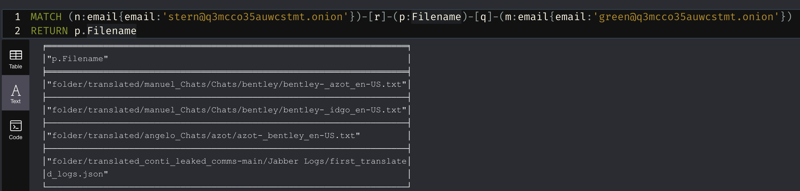
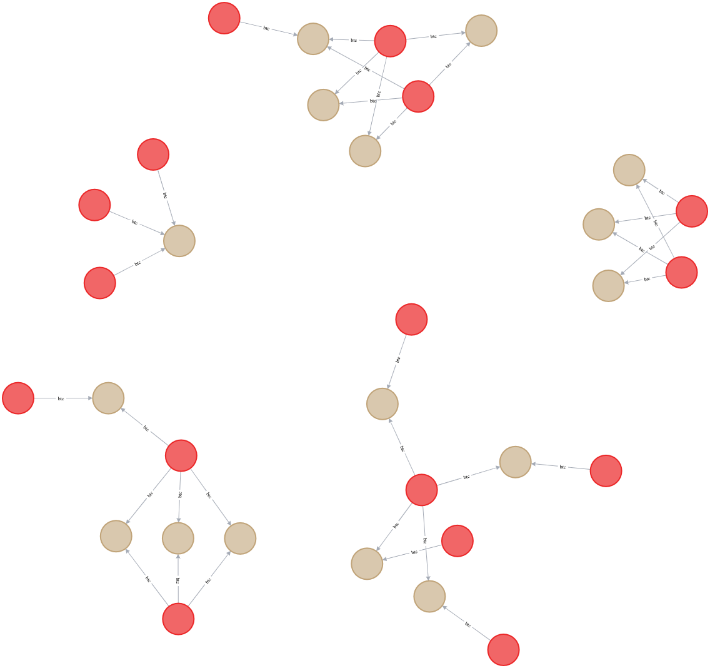
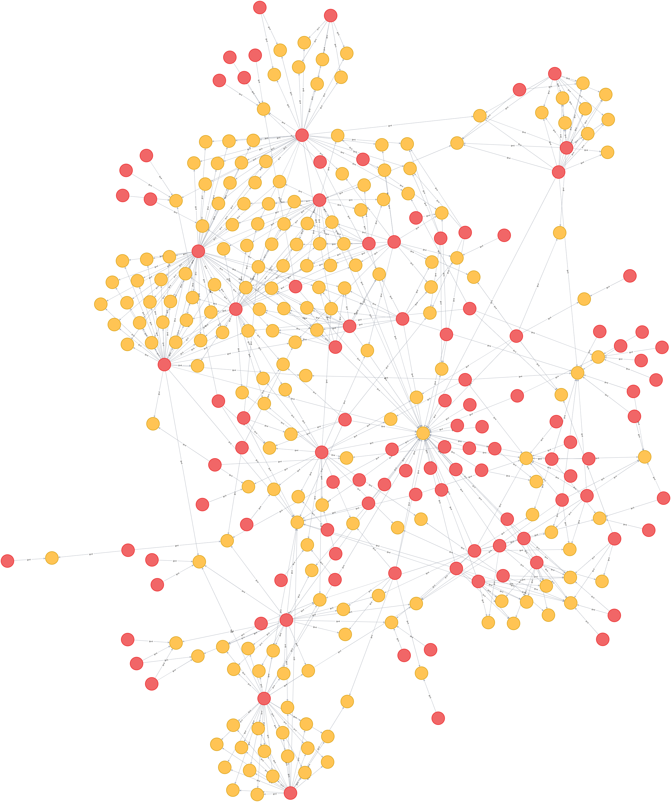
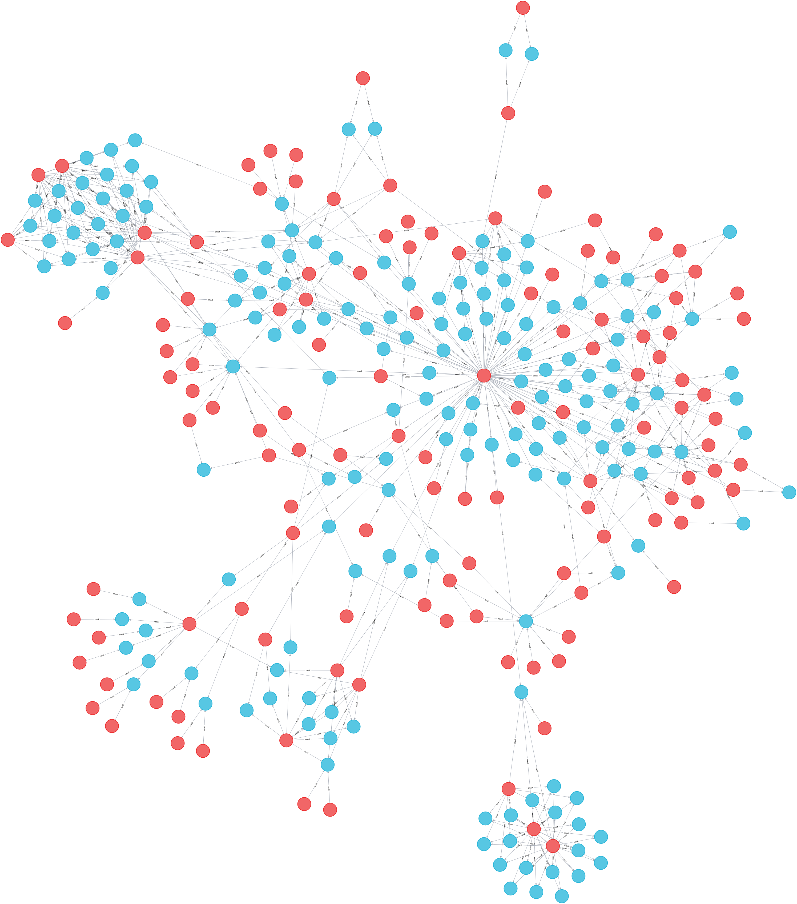
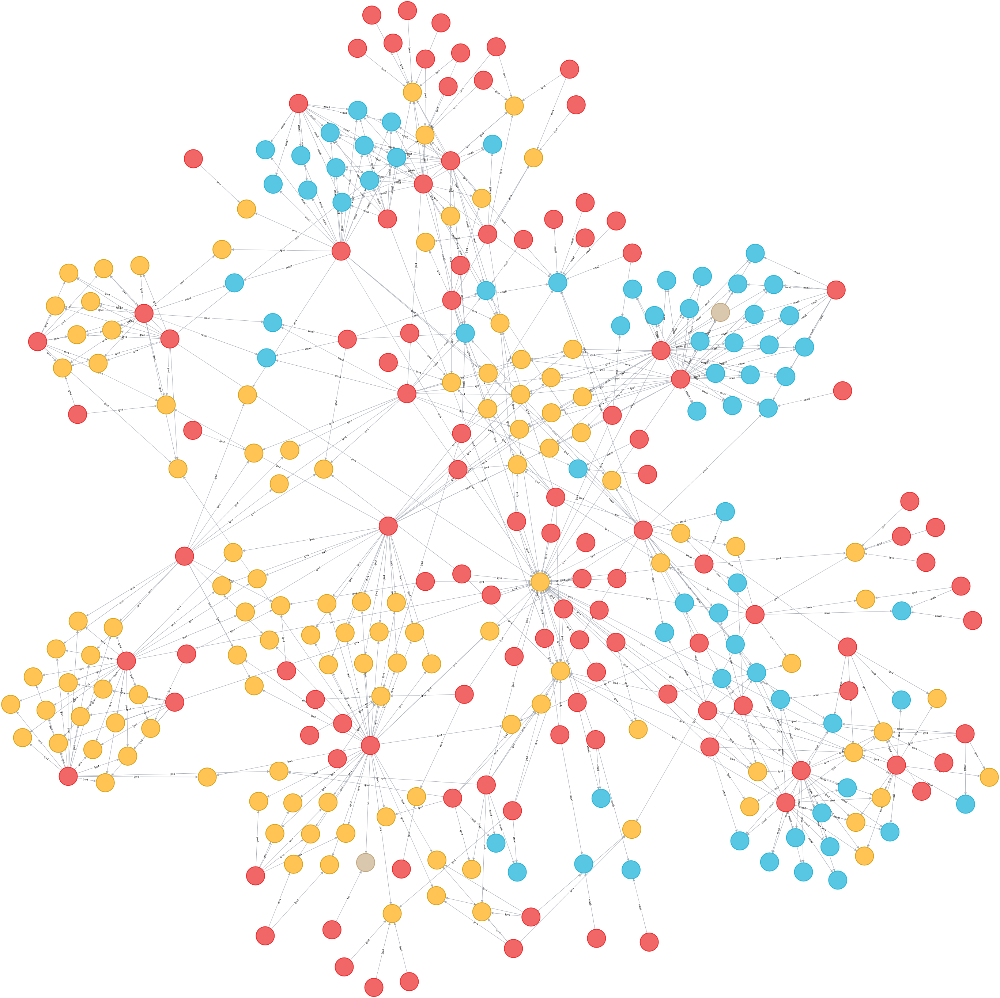

# neo4jconti

A python script to process unstructured files into Neo4j by regex extracting interesting features, including:

- Bitcoin addresses
- IPv4 addresses
- Email addresses

Pre-requisites:
[Neo4j](https://neo4j.com/developer/docker/), [Tika](https://hub.docker.com/r/apache/tika)

Update the following before use...

Neo4j settings:

- NEO4J_SCHEMA
- NEO4J_HOST_NAME
- NEO4J_PORT
- NEO4J_USER
- NEO4J_PASSWORD

Tika settings:

- TIKA_PORT
- TIKA_HOST

Example usage:

`python neo4jconti.py folder out.csv`

CSV output after running extraction on recent Conti leaks: [csv](./out.csv)

Cypher query to find files containing both stern@q3mcco35auwcstmt.onion and green@q3mcco35auwcstmt.onion:

`MATCH (n:email{email:'stern@q3mcco35auwcstmt.onion'})-[r]-(p:Filename)-[q]-(m:email{email:'green@q3mcco35auwcstmt.onion'})
RETURN p.Filename`

Cypher query to find files containing the same btc addresses:

`MATCH (a:Filename)-[b]-(c:btc)-[d]-(e:Filename)
WITH a, COUNT(b) as rel_cnt
WHERE rel_cnt > 1
MATCH (a:Filename)-[b]-(c:btc)-[d]-(e:Filename)
RETURN a,b,c,d,e;`

Cypher query to find files containing the same ipv4 addresses:

`MATCH (a:Filename)-[b]-(c:ipv4)-[d]-(e:Filename)
WITH a, COUNT(b) as rel_cnt
WHERE rel_cnt > 1
MATCH (a:Filename)-[b]-(c:ipv4)-[d]-(e:Filename)
RETURN a,b,c,d,e;`

Cypher query to find files containing the same email addresses:

`MATCH (a:Filename)-[b]-(c:email)-[d]-(e:Filename)
WITH a, COUNT(b) as rel_cnt
WHERE rel_cnt > 1
MATCH (a:Filename)-[b]-(c:email)-[d]-(e:Filename)
RETURN a,b,c,d,e;`

Cypher query to find files containing the same extracted values:

`MATCH (a:Filename)-[b]-(c)-[d]-(e:Filename)
WITH a, COUNT(b) as rel_cnt
WHERE rel_cnt > 1
MATCH (a:Filename)-[b]-(c)-[d]-(e:Filename)
RETURN a,b,c,d,e;`

